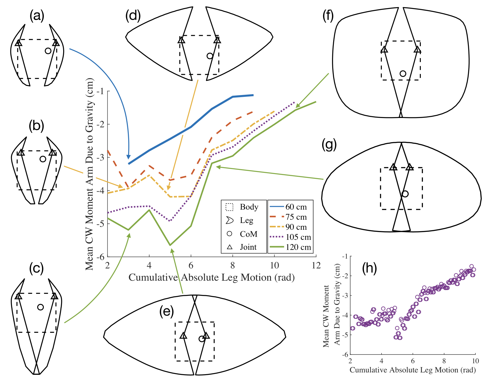
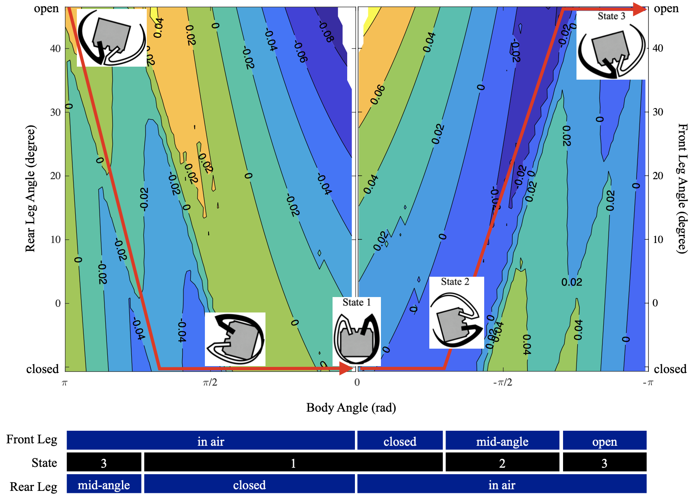
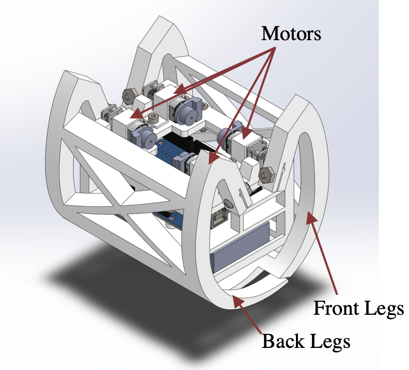
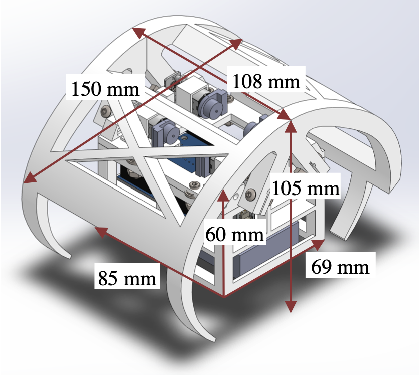

<h1 align="center">
Leg Shaping and Event-Driven Control of a Small-Scale, Low-DoF, Two-Mode Robot
</h1>

<div align="center">
<h3>
<a href="https://dkguo.com">Dingkun Guo</a>,
Larissa Wermers, and
<a href="https://me.engin.umich.edu/people/faculty/kenn-oldham/">Kenn R. Oldham</a>
<br>
<br>
IEEE/ASME Transactions on Mechatronics, 2022
<br>
<br>
IEEE/ASME International Conference on Advanced Intelligent Mechatronics (AIM), 2022
<br>
<br>
<a href="https://arxiv.org/pdf/2205.14579.pdf">[Paper]</a>
<a href="https://dkguo.com/research/walk2roll">[Website]</a>
<a href="https://youtu.be/P6FxYMbSkI4"> [Presentation]</a>
<br>
</h3>
<br>
<p align="center">


</p>
<br>
</div>

# Citation
Please cite this work if it helps your research:

```
@ARTICLE{walk2roll,  
  author={Guo, Dingkun and Wermers, Larissa and Oldham, Kenn R.},
  journal={IEEE/ASME Transactions on Mechatronics}, 
  title={Leg Shaping and Event-Driven Control of a Small-Scale, Low-DoF, Two-Mode Robot}, 
  year={2022},
  volume={27},
  number={4},
  pages={1910-1918},
  doi={10.1109/TMECH.2022.3173183}}
```

# Overview
In this work, we design and prototype a two-DoF walking-rolling robot. This repository contains
1) Code for leg profile generation and analysis
2) CAD files of the prototype
3) Code of the event-driven controller

# Prerequisites
This code is tested with MATLAB, Arduino, and Arduino UNO Wifi Rev 2.

# Leg profile generation and analysis
In `design` foler:
1. The MATLAB file to randomly generate leg profiles and calculate J1 and J2 will be added by request. A `.mat` file that contains the raw data from the Monte Carlo simulations is provided [here](https://drive.google.com/file/d/1t3DsJioSSCW6Dw8d_Bq3EJVaL-_BnXOD/view?usp=sharing). You can load it first and run the remaining files.
2. Run `a_CriteriaPlots.m`, `b_CleanTrends.m`, `c_ApproximateParetoCurve.m` sequentially to generate figures in the paper.

<p float="left">


</p>

# CAD
CAD files used for 3D printing the robot are included in `CAD` folder.

<p float="left">


</p>

# Event-driven controller
An electrical diagram for the robot is shown below:


In `controller` folder, compile and upload `roll.ino`, `walk.ino`, or `roll_and_walk.ino` to Arduino board and the robot is alive!

Note: The definitions of front and rear legs are opposite to those in the paper. The state numbers are also different.

