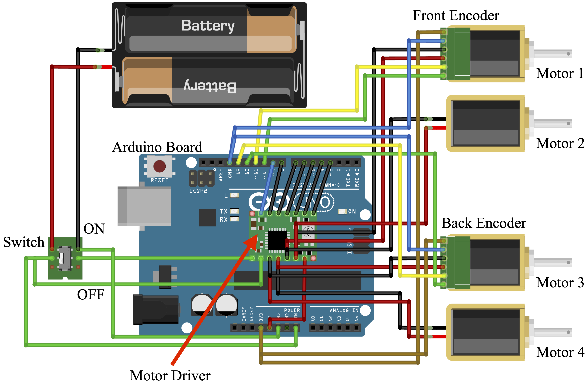

<h1 align="center">
Leg Shaping and Event-Driven Control of a Small-Scale, Low-DoF, Two-Mode Robot
</h1>

<div align="center">
<h3>
<a href="https://dkguo.com">Dingkun Guo</a>,
Larissa Wermers, and
<a href="https://me.engin.umich.edu/people/faculty/kenn-oldham/">Kenn R. Oldham</a>
<br>
<br>
IEEE/ASME Transactions on Mechatronics, 2022
<br>
<br>
IEEE/ASME International Conference on Advanced Intelligent Mechatronics (AIM), 2022
<br>
<br>
<a href="https://dkguo.com/academic/publications/J1_walk2roll.pdf">[Paper]</a>
<a href="https://dkguo.com/research/walk2roll">[Project page]</a>
[Presentation (coming soon on AIM 2022)]
<br>
</h3>
</div>


# Citation
Please cite this work if it helps your research:

```
@ARTICLE{walk2roll,  
	author={Guo, Dingkun and Wermers, Larissa and Oldham, Kenn R.},  
	journal={IEEE/ASME Transactions on Mechatronics},   
	title={Leg Shaping and Event-Driven Control of a Small-Scale, Low-DoF, Two-Mode Robot},   
	year={2022},  volume={},  number={},  pages={1-9},  
	doi={10.1109/TMECH.2022.3173183}}
```

# Overview
In this work, we design and prototype two-DoF walking-rolling robot. This repository contains the code of 
1) Leg profile generation and analysis
2) CAD files of the prototype
3) Event-driven controller

# Prerequisites
This code is tested with MATLAB, Arduino, and Arduino UNO Wifi Rev 2.

# Leg profile generation and analysis
In `design` foler:
1. Run `TODO` to randomly generate leg profiles and calculate J1 and J2. A `.mat` file that contains the raw data from the Monte Carlo simulations is provided [here](https://drive.google.com/file/d/1t3DsJioSSCW6Dw8d_Bq3EJVaL-_BnXOD/view?usp=sharing). You can load it first and run the remaining files.
2. Run `a_CriteriaPlots.m`, `b_CleanTrends.m`, `c_ApproximateParetoCurve.m` sequentially to generate figures in the paper.

# CAD
CAD files used for 3D printing the robot is included in `CAD` folder.

# Event-driven controller
An electrical diagram for the robot is shown here:


In `controller` folder, compile and upload `roll.ino`, `walk.ino`, or `roll_and_walk.ino` to Arduino board and the robot is alive!
